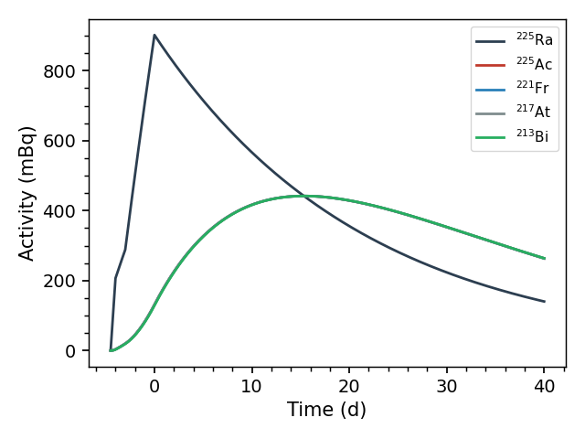
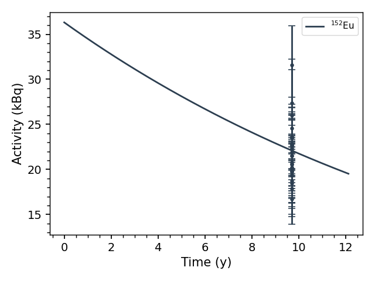

.. _isotopes_tutorial:

=============================
Decay Chain Tutorial
=============================

This tutorial works a decay-chain problem in each direction: first
*forward* — modeling the production and decay of :sup:`225`\ Ra, a
generator of the medical isotope :sup:`225`\ Ac — and then *inverse* —
fitting the activity of the :sup:`152`\ Eu source measured in the
:ref:`spectroscopy_tutorial`, and checking it against the source's
certificate.

Forward: producing 225Ra
------------------------

Suppose a target is irradiated for 4.5 days, producing :sup:`225`\ Ra
(half-life 14.9 d), but the beam current varied: the production rate was
9 atoms/s for the first half day, dropped to 2/s for the next day, and
recovered to 5/s for the remaining three days.  This piecewise-constant
history is exactly what the ``R`` argument describes — each row is
``[rate, time]`` with ``time`` the end of that interval::

	import curie as ci
	import numpy as np

	dc = ci.DecayChain('225RA', R=[[9, 0.5], [2, 1.5], [5, 4.5]], units='d')
	print(dc.isotopes)

.. code-block:: none

	['225RAg', '225ACg', '221FRg', '217ATg', '213BIg', '217RNg',
	 '209TLg', '213POg', '209PBg', '209BIg', '205TLg']

Curie followed the decay data all the way to stability: the chain
includes :sup:`225`\ Ac and its short-lived descendants down to stable
thallium and bismuth.  Plotting shows the whole history — production
before t = 0, decay after::

	dc.plot(time=np.linspace(0, 40, 500), max_plot=5)

The parent's activity peaks at the end of bombardment (t = 0), while
:sup:`225`\ Ac grows in for about two weeks afterwards — the daughters sit
on a common curve because the sub-:sup:`225`\ Ac chain reaches equilibrium
within hours.  Any single value is available directly, in the chain's
units (days here)::

	>>> print(dc.activity('225AC', time=10))
	0.4168212066113324
	>>> print(dc.R_avg)
	  isotope     R_avg
	0  225RAg  4.777778

If measured counts of any chain member are available, ``dc.fit_R()``
rescales this production history to match them (the shape — the beam's
ups and downs — is preserved; only the overall scale is fit).

Inverse: how active was the 152Eu source?
-----------------------------------------

The :ref:`spectroscopy_tutorial` calibrated a detector with a
:sup:`152`\ Eu source certified at 37.0 kBq on 01/01/2009, using a
spectrum counted in 2018.  Here we ask the reverse question: given only
that spectrum's fitted peaks, what was the source activity on the
certificate date?

Starting from the calibrated spectrum ``sp`` of that tutorial, build a
decay-only chain (an ``A0`` guess rather than a production history) and
load the measured decays from the spectrum.  The certificate date is our
t = 0, passed as the ``EoB`` (end-of-bombardment) argument — despite the
name, it is simply the t = 0 reference time, even when, as here, nothing
was bombarded::

	dc = ci.DecayChain('152EU', A0=3.7E4, units='y')
	dc.get_counts([sp], EoB='01/01/2009 12:00:00')

``get_counts()`` took each fitted gamma line's decays from ``sp.peaks``
and placed the count interval on the chain's clock — 9.7 years after
t = 0::

	>>> print(dc.counts[['isotope', 'start', 'stop', 'counts', 'unc_counts']].head(3))
	  isotope     start      stop        counts    unc_counts
	0  152EUg  9.697086  9.697163  5.537235e+07  1.366835e+07
	1  152EUg  9.697086  9.697163  5.576780e+07  8.454064e+06
	2  152EUg  9.697086  9.697163  4.874544e+07  1.161682e+07

(The same works without the live spectrum: ``get_counts`` also accepts
the peak file the spectroscopy tutorial saved, as
``dc.get_counts(['eu_calib_7cm.Spe'], EoB=..., peak_data='eu_peaks.csv')``.)
Now fit the initial activity::

	>>> isotopes, A0_fit, cov = dc.fit_A0()
	>>> print('{:.3g} +/- {:.2g} Bq'.format(A0_fit[0], np.sqrt(cov[0][0])))
	3.63e+04 +/- 2.5e+03 Bq

and plot the fitted decay curve against the measurements::

	dc.plot(max_plot=1, max_plot_error=0.2)

The fitted activity at the certificate date is 36.3 ± 2.5 kBq — in
agreement with the certified 37.0 kBq.  Each point in the plot is one
gamma line's estimate of the activity; the fit combines them while
accounting for their shared uncertainties, the efficiency calibration and
the line intensities.  Shared errors cannot be averaged away by adding
more lines, so the combined uncertainty is larger — and more honest —
than a naive average of the points would suggest.

Here the source decayed freely, so ``fit_A0()`` was the right tool.  In
an activation experiment you would instead give the chain your estimated
production history ``R`` and call ``fit_R()`` — everything else,
``get_counts()`` included, works the same way.
