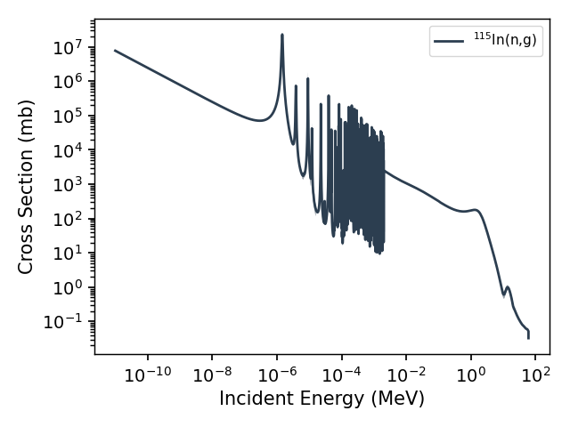

.. _reactions:

=========
Reactions
=========

Curie provides evaluated nuclear reaction cross sections through two
classes: the `Reaction` class holds the cross section for one specific
reaction — its energy grid, values, uncertainties (where available), and
methods to interpolate, flux-average and plot — and the `Library` class
searches the underlying data libraries for what reactions exist.

   The :sup:`115`\ In(n,g) capture cross section (IRDFF-II), across ten
   orders of magnitude in incident energy.

Reactions are named in standard nuclear reaction notation — the pattern
is ``TARGET(incident,outgoing)PRODUCT``, with isotopes written in either
of Curie's name forms::

	rx = ci.Reaction('115IN(n,g)')             # neutron capture on 115In
	rx = ci.Reaction('Ra-226(n,2n)Ra-225')     # (n,2n), naming the product
	rx = ci.Reaction('natTI(p,x)48V')          # any route from natural Ti to 48V

All cross sections are in mb, and all energies in MeV.

Workflow
--------

Using reaction data usually takes three steps:

1. **Find** the reaction.  If you know its name, construct it directly;
   if not, `Library.search()` lists what a library contains
   (``ci.Library('iaea').search(target='natTI', incident='p')``).
2. **Choose** the source.  By default (``library='best'``) Curie picks
   the highest-priority library carrying the reaction; pass a library
   name to choose yourself.  ``rx.library.name`` always tells you what
   you got.
3. **Use** the data: ``rx.interpolate(energy)`` for values on your own
   energy grid, ``rx.average(energy, flux)`` for the flux-averaged cross
   section of a measurement, ``rx.plot()`` to look at it.

The :ref:`reactions_tasks` page details each step, the
:ref:`reactions_tutorial` works a complete monitor-reaction example with
library comparisons, and :ref:`reactions_troubleshooting` covers the
common failure modes.

Uses and limitations
--------------------

These are *evaluated* libraries — smooth, recommended curves produced by
evaluators from experimental data and nuclear-model calculations — not
raw experimental data points (EXFOR is not included).  Each library has a
scope and a character: the IAEA library is a set of precisely evaluated
monitor (beam-normalization) reactions with uncertainties; IRDFF-II is a
neutron-dosimetry standard, also with uncertainties; ENDF/B-VII.1 is the
general-purpose neutron evaluation; and the TENDL-2015 libraries are
theory-driven (TALYS-based) evaluations whose strength is complete
coverage — nearly every target and product, including reactions no one
has measured.  Where they overlap, they will not agree perfectly; which
to prefer, and what to watch out for (energy-grid limits, natural vs
isotopic targets, cumulative vs direct production), is the subject of
the tutorial.

.. toctree::
   :maxdepth: 1

   reactions_tasks
   reactions_tutorial
   reactions_troubleshooting
