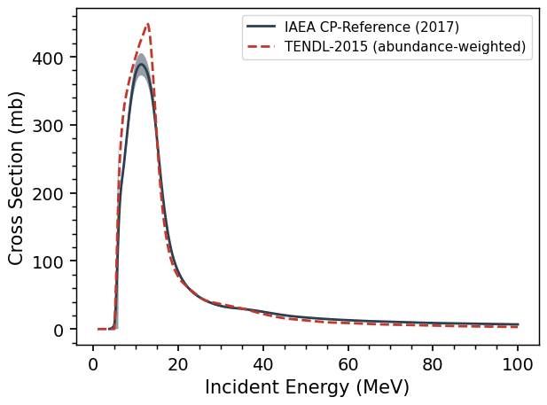
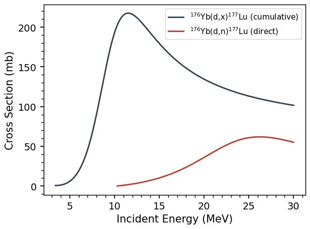
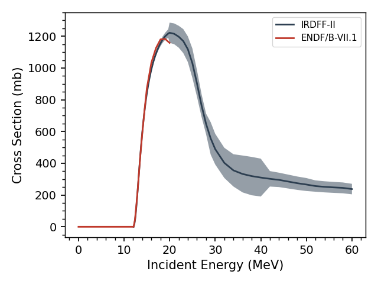

.. _reactions_tutorial:

=========================
Reactions Worked Examples
=========================

This page works through the reaction data behind a typical
charged-particle activation measurement — a *monitor reaction* — and uses
it to show how the libraries differ, and why those differences matter:
natural versus isotopic targets, cumulative versus direct production, and
the limits of each library's energy grid.

A monitor reaction
------------------

In a stacked-target irradiation, thin foils of well-studied materials are
interleaved with the samples: the activities induced in these *monitor
foils*, together with precisely evaluated cross sections, measure the
beam current and energy in each position.  The IAEA maintains the
reference library for exactly this purpose, and it is where Curie's
default library search sends charged-particle reactions::

	>>> import curie as ci
	>>> import numpy as np

	>>> rx = ci.Reaction('natTI(p,x)48V')
	>>> print(rx.library.name)
	IAEA CP-Reference (2017)

Note the notation: a *natural* titanium target (``natTI`` — monitor foils
are natural metal), and ``(p,x)`` — any reaction route that ends at
:sup:`48`\ V.  The IAEA library provides uncertainties, so the
flux-averaged cross section of a measurement comes with an error bar.
For a proton spectrum centered at 20 MeV::

	>>> eng = np.linspace(10, 30, 50)
	>>> phi = np.exp(-0.5*((eng - 20)/3.5)**2)
	>>> print(rx.average(eng, phi, unc=True))
	(116.4..., 4.8...)

Natural vs. isotopic targets
----------------------------

The TENDL-2015 residual-product library also carries this reaction — but
only for *isotopic* targets; it has no natural-element entries.  A
natural-target cross section is the abundance-weighted sum over the
stable isotopes.  ``ci.Element('Ti').abundances`` provides exactly what
the sum needs: a table of the stable isotopes with their percent
abundances (columns ``isotope`` and ``abundance``)::

	el = ci.Element('Ti')
	eng = np.linspace(1, 100, 500)
	xs_nat = np.zeros_like(eng)

	for n, row in el.abundances.iterrows():
		try:
			r = ci.Reaction('{0}(p,x)48Vg'.format(row['isotope']), 'tendl_p')
		except ValueError:
			continue      # this isotope has no route to 48V
		xs_nat += 1E-2*row['abundance']*r.interpolate(eng)

(The explicit ``g`` on the product picks the ground state — leaving it
off works, but prints the ground-state-assumed warning for every
isotope.)

The ``try``/``except`` is doing real physics: :sup:`46`\ Ti + p has only
47 nucleons, so it cannot make :sup:`48`\ V at any energy, and TENDL has
no such entry.  Overlaying the weighted sum on the IAEA evaluation::

	f, ax = rx.plot(return_plot=True, label='library')
	ax.plot(eng, xs_nat, ls='--', label='TENDL-2015 (abundance-weighted)')
	ax.legend()

The two agree in shape but differ by ~15% at the peak.  That is typical,
and it reflects what each library *is*: the IAEA curve is an evaluation
of decades of monitor-foil measurements; the TENDL curve comes from
nuclear-model (TALYS) calculations, whose strength is covering every
reaction — including ones never measured — rather than pinpoint accuracy
on any one.  For beam monitoring, use the IAEA values.

Cumulative vs. direct production
--------------------------------

A subtlety of residual-product data: does "production of X" include the
decay of short-lived parents into X, or only X made directly?  The IAEA
library distinguishes the two where it matters.  For :sup:`177`\ Lu — the
therapy isotope — produced by deuterons on :sup:`176`\ Yb, both are
evaluated::

	ra = ci.Reaction('176YB(d,x)177LUg', 'iaea')   # cumulative
	rb = ci.Reaction('176YB(d,n)177LUg', 'iaea')   # direct only

	f, ax = ra.plot(return_plot=True, label='reaction')
	rb.plot(f=f, ax=ax, label='reaction')

The cumulative curve — here several times the direct one — includes
:sup:`177`\ Yb, which is also made by the beam and decays entirely to
:sup:`177`\ Lu with a 1.9 h half-life.  After a few hours of cooling,
the cumulative cross section is what an activity measurement of
:sup:`177`\ Lu actually sees.  TENDL's residual-product entries are, by
contrast, *independent*: each state's direct production only, with decay
feeding left to you (`DecayChain` does exactly that bookkeeping — see
:ref:`isotopes`).  When comparing libraries or using a cross section to
predict an activity, always ask which convention you are holding.

Neutron libraries and the 20 MeV cutoff
---------------------------------------

The same look-before-you-use advice applies to energy grids.  Most
ENDF/B-VII.1 neutron evaluations stop at 20 MeV; IRDFF-II extends its
dosimetry reactions to 60 MeV::

	r1 = ci.Reaction('90ZR(n,2n)', 'irdff')
	f, ax = r1.plot(return_plot=True, label='library')
	r2 = ci.Reaction('90ZR(n,2n)', 'endf')
	r2.plot(f=f, ax=ax, label='library')

The two agree where they overlap — but the ENDF curve simply ends at
20 MeV, in the middle of the peak.  Beyond a library's grid Curie
returns *zero* rather than extrapolating, so a flux average silently
loses whatever part of the spectrum the library doesn't cover.  For a
flat 12–30 MeV flux::

	>>> eng = np.linspace(12, 30, 50)
	>>> print(r1.average(eng, np.ones(50)))   # IRDFF-II
	885.1...
	>>> print(r2.average(eng, np.ones(50)))   # ENDF: zero above 20 MeV
	362.6...

Same reaction, same flux — and a factor of 2.4 between the answers,
entirely from the grid.  Whenever your spectrum extends above ~20 MeV,
check the reaction's ``.eng.max()`` against it, and prefer IRDFF-II (or
TENDL, which extends to 200 MeV) for the high-energy part.
