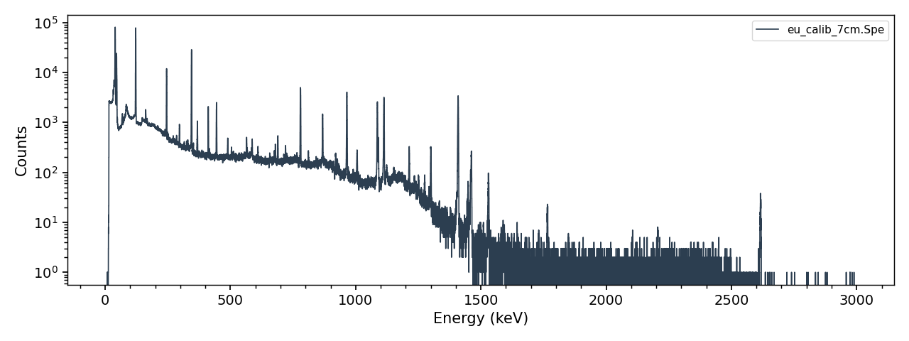
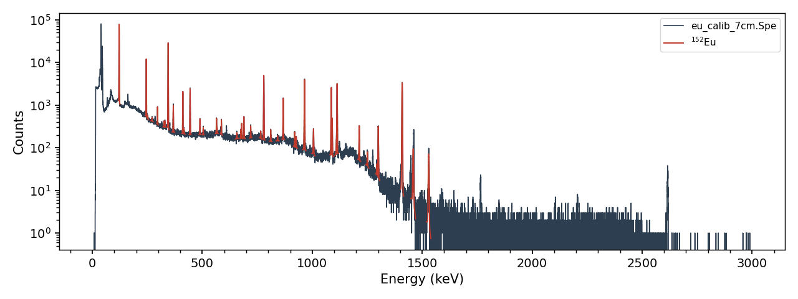
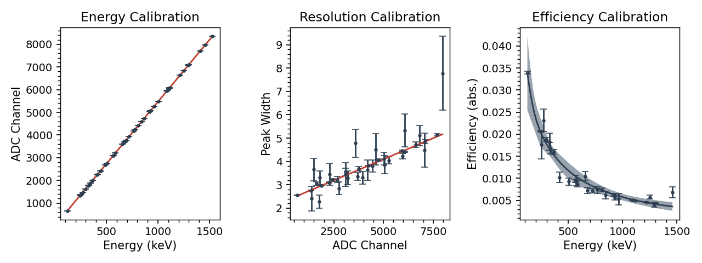

.. _spectroscopy_tutorial:

============================
Spectroscopy Worked Examples
============================

This page walks through a complete efficiency calibration using
``eu_calib_7cm.Spe`` — a spectrum of a :sup:`152`\ Eu reference source
counted 7 cm from an HPGe detector, available in the `examples folder`_ of
the Curie repository.  The source had a certified activity of 37.0 kBq
(1.0 uCi) on 01/01/2009.

.. _examples folder: https://github.com/jtmorrell/curie/blob/master/examples/

Loading and inspecting the spectrum
-----------------------------------

Load the spectrum and plot the raw histogram::

	import curie as ci

	sp = ci.Spectrum('eu_calib_7cm.Spe')
	sp.plot(fit=False)

The energy calibration stored in the .Spe file header was read
automatically::

	>>> print(sp.cb.engcal)
	[3.3973e-01 1.8297e-01 5.5683e-09]

Fitting the peaks
-----------------

Tell Curie which isotopes are present, and it will fit every
:sup:`152`\ Eu line that passes the selection criteria (see
:ref:`spectroscopy_tasks`)::

	sp.isotopes = ['152EU']
	sp.plot()

Fitting the efficiency calibration
----------------------------------

The peak counts are correct at this point, but the decay rates are not:
they are computed with the built-in default efficiency curve, not one
measured for this detector.  Calibrating requires the reference activity
and date of the source::

	cb = ci.Calibration()
	cb.calibrate([sp], sources=[{'isotope':'152EU', 'A0':3.7E4,
	                             'ref_date':'01/01/2009 12:00:00'}])
	cb.plot()

`calibrate()` refit the energy, resolution and efficiency calibrations
from the fitted peaks (the procedure and functional forms are described in
:ref:`methods_calibration`), and applied them to the spectrum.  The fitted
efficiency parameters (and their uncertainties) are stored on the
calibration::

	>>> print(cb.effcal)
	[5.02300989e-02 1.00000000e+02 2.82394962e+00 2.45721823e+00
	 2.91455256e-01]

Checking the results
--------------------

With the calibration applied, the peak table now reports consistent decay
rates across lines spanning 122 to 1408 keV::

	>>> print(sp.peaks[['isotope','energy','counts','unc_counts','intensity',
	...                 'efficiency','decay_rate','unc_decay_rate','chi2']].head(8))
	  isotope    energy    counts  unc_counts  intensity  efficiency  decay_rate  unc_decay_rate   chi2
	0   152EU  121.7817  498786.0      3118.0   0.285300     0.03385     22564.0          5570.0  20.18
	1   152EU  244.6974   80193.0       403.0   0.075500     0.02042     22725.0          3445.0   1.96
	2   152EU  251.6330     610.0       112.0   0.000670     0.02002     19864.0          4734.0   1.96
	3   152EU  271.0800     853.0        93.0   0.000715     0.01903     27381.0          4856.0   0.93
	4   152EU  295.9387    4258.0        98.0   0.004400     0.01792     23594.0          2803.0   0.90
	5   152EU  324.8300     642.0        64.0   0.000681     0.01676     24556.0          3486.0   0.92
	6   152EU  329.4100    1055.0        78.0   0.001213     0.01659     22900.0          2792.0   0.92
	7   152EU  344.2785  213990.0       669.0   0.265900     0.01605     21911.0          2030.0   2.19

The ``decay_rate`` column — the activity of the source during the count —
clusters around 22.6 kBq for every line: the 37.0 kBq source decayed for
9.7 years — a bit under one 13.5 y half-life — between the reference
date and the count.
(The large ``chi2`` on the very intense 122 keV peak is expected for a
peak with half a million counts — see the note on high-statistics peaks in
:ref:`spectroscopy_troubleshooting`.)  ``sp.summarize()`` prints the same
information line by line::

	>>> sp.summarize()
	...
	152EU - 244.6974 keV (I = 7.55%)
	--------------------------------
	counts: 80193 +/- 403
	decays: 5.577e+07 +/- 8.454e+06
	activity (Bq): 2.273e+04 +/- 3.445e+03
	activity (uCi): 6.142e-01 +/- 9.311e-02
	chi2/dof: 1.958
	...

Saving and re-using the calibration
-----------------------------------

Save the calibration, and apply it to any other spectrum counted in the
same geometry — here ``your_sample.Spe`` and :sup:`64`\ Cu stand in for
a later measurement of your own (substitute your own spectrum)::

	cb.saveas('eu_calib.json')

	sp2 = ci.Spectrum('your_sample.Spe')
	sp2.cb = 'eu_calib.json'
	sp2.isotopes = ['64CU']
	sp2.summarize()

Note that the saved file replaces the new spectrum's energy calibration
too — if peaks shift or vanish after this step, see
:ref:`spectroscopy_troubleshooting`.

The peak data can be exported for further analysis — for example to fit a
decay curve with `DecayChain.get_counts()` (see :ref:`isotopes`)::

	sp.saveas('eu_peaks.csv')
