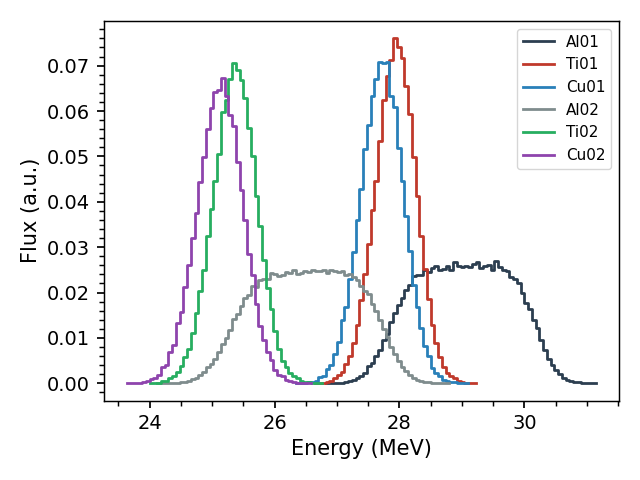

.. _stopping:

===========================
Stopping Power Calculations
===========================

Three classes handle the interaction of particles with bulk matter.
`Element` and `Compound` describe the materials: their charged-particle
stopping powers and ranges (Andersen–Ziegler formulation, any element up
to uranium), and their photon attenuation coefficients.  `Stack` puts
materials in a beam: it transports charged particles through a stack of
foils and computes the energy distribution of the beam in every layer —
the quantity that connects an irradiation to its cross sections.

   A 30 MeV proton beam degrading through a six-foil stack: each foil
   sees a lower, wider energy distribution.

**Workflow.**  `Element` and `Compound` answer design questions directly — how much
energy does a proton lose in this foil (``S``), how thick a degrader do I
need (``range``), how strongly does this sample absorb gamma rays
(``attenuation``).  A `Stack` calculation follows three steps:

1. **Define the materials**: natural elements by symbol, compounds by
   chemical formula, preset name (``ci.COMPOUND_LIST``), or explicit
   elemental weights.
2. **Define the stack**: an ordered list of foils (first foil hit first),
   each with a compound and enough information to fix its areal density
   (mass per unit beam area, in mg/cm2), and a ``name`` for each foil you
   want tallied.
3. **Transport and use**: ``ci.Stack(stack, E0=..., particle='p')``
   computes every foil's mean energy, energy width and full flux
   distribution — and ``rx.average(*st.get_flux('name'))`` turns the
   latter into the effective cross section of that foil.

See the :ref:`stopping_tasks` for each step in detail, the
:ref:`stopping_tutorial` for the build-up from single stopping powers to
the thin-vs-thick foil comparison, and :ref:`stopping_troubleshooting`
for the common pitfalls.

**Uses and limitations.**  The stopping powers are the Andersen–Ziegler semi-empirical
parameterization (see :ref:`methods_stopping`): protons, deuterons,
tritons and alphas are supported directly, and heavier ions through an
effective-charge scaling.  Compound stopping powers use Bragg additivity
(weighted sums of the elemental values), which neglects chemical-bonding
effects — a percent-level approximation, worst for light compounds at
low energies.

`Stack` models energy loss only: particles slow down but are never
absorbed or deflected, so the computed flux distributions describe the
beam's *energy*, not its attenuated intensity, and lateral spread is not
modeled.  The width of each foil's energy distribution comes from the
incident beam spread (``dE0``) plus the spread the beam picks up as it
degrades — slower particles lose energy faster, so an initially narrow
beam broadens as it slows.  Collisional straggling is not added on top,
so very thick degraders will in reality produce a somewhat wider
distribution than computed (see :ref:`methods_stopping`).

.. toctree::
   :maxdepth: 1

   stopping_tasks
   stopping_tutorial
   stopping_troubleshooting
