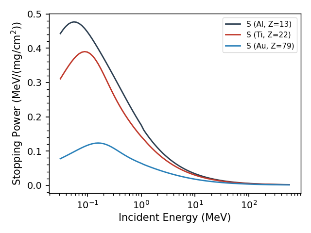
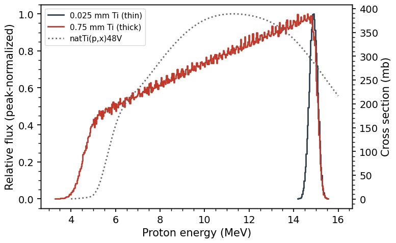

.. _stopping_tutorial:

==============================
Stopping Power Worked Examples
==============================

This page builds from single stopping powers up to a foil stack, and
ends with the comparison that motivates the whole machinery: how the
beam's energy *distribution* in a foil — not just its mean energy —
determines the effective cross section.

Stopping powers
---------------

A charged particle slows continuously in matter, losing energy at the
rate :math:`S = -dE/dx` — the *stopping power*.  Curie computes it from
the Andersen–Ziegler parameterization (see :ref:`methods_stopping`) for
any element or compound::

	>>> import curie as ci
	>>> import numpy as np

	>>> el = ci.Element('Ti')
	>>> print(el.S(15.0))              # MeV/cm for 15 MeV protons
	99.179...
	>>> print(el.S(15.0, density=1E-3))  # MeV/(mg/cm2), the mass stopping power
	0.02194...

Overlaying a few elements shows the systematics — stopping falls with
energy (faster particles interact less) and, per unit mass, with the
atomic number of the material::

	f, ax = ci.Element('Al').plot_S(return_plot=True)
	ci.Element('Ti').plot_S(f=f, ax=ax)
	ci.Element('Au').plot_S(f=f, ax=ax)

Ranges
------

Integrating the stopping power gives the *range* — how far the particle
travels before stopping::

	>>> print(el.range(15.0))       # cm
	0.0871...
	>>> print(10*el.range(15.0))    # mm
	0.871...

A 15 MeV proton stops in under a millimeter of titanium.  Numbers like
these are the first sanity check of any stack design: a foil much
thinner than the range perturbs the beam gently; one comparable to the
range consumes it.  Compounds work identically, with presets for common
materials::

	>>> cm = ci.Compound('Kapton')     # in ci.COMPOUND_LIST
	>>> print(cm.density)
	1.42
	>>> print(cm.range(15.0))          # cm, as for elements
	0.2036...
	>>> print(cm.range(15.0, density=1E-3))
	289.24...

The second form (the ``density=1E-3`` idiom again) gives the range as a
*areal density* (mass thickness) in mg/cm2 — the unit stacked-target work is done in,
since foils are weighed rather than measured.

A first stack
-------------

Now put foils in a beam.  A common pattern is repeating groups of
monitor and target foils separated by degraders — here two Al–Ti–Cu
groups in a 30 MeV proton beam::

	stack = [{'cm':'Al', 't':0.5,   'name':'Al01'},
	         {'cm':'Ti', 't':0.025, 'name':'Ti01'},
	         {'cm':'Cu', 't':0.025, 'name':'Cu01'},
	         {'cm':'Al', 't':0.5,   'name':'Al02'},
	         {'cm':'Ti', 't':0.025, 'name':'Ti02'},
	         {'cm':'Cu', 't':0.025, 'name':'Cu02'}]

	st = ci.Stack(stack, E0=30.0, particle='p')

Thicknesses are in mm; Curie converts them to areal densities using each
material's preset density.  The result is an energy assignment for every
foil::

	>>> print(st.stack)
	   name compound  areal_density       mu_E     sig_E
	0  Al01       Al       134.9000  29.015085  0.730443
	1  Ti01       Ti        11.2975  27.935964  0.321319
	2  Cu01       Cu        22.3725  27.717674  0.337406
	3  Al02       Al       134.9000  26.517634  0.772389
	4  Ti02       Ti        11.2975  25.357176  0.346504
	5  Cu02       Cu        22.3725  25.121974  0.364116

	st.plot()

.. figure:: ../images/stack_fluxes.png
   :width: 80%
   :align: center

Each successive foil sees a lower mean energy.  The widths follow the
foils: ``sig_E`` is dominated by how much energy the beam loses *within*
each foil, so the thick Al degraders show wide, path-averaged
distributions (0.73, 0.77 MeV) while the thin Ti and Cu foils record the
beam's instantaneous spread (~0.33 MeV) at their depth.

Thin and thick foils: when the mean energy isn't enough
--------------------------------------------------------

It is tempting to characterize each foil by ``mu_E`` alone and read the
cross section off at that energy.  For thin foils that works.  For thick
foils it can fail badly, because the beam spans a wide slice of the
excitation function (the cross section as a function of energy) inside
the foil.  Compare a 25 um and a 0.75 mm
titanium foil, both hit by 15 MeV protons (the range is 0.87 mm — the
thick foil eats most of the beam's energy)::

	rx = ci.Reaction('natTI(p,x)48V')

	st_thin  = ci.Stack([{'cm':'Ti', 't':0.025, 'name':'thin'}],  E0=15.0)
	st_thick = ci.Stack([{'cm':'Ti', 't':0.75,  'name':'thick'}], E0=15.0)

The thin foil's flux is a narrow spike near 15 MeV; the thick foil's
stretches from 15 MeV all the way down to ~4 MeV, across the entire peak
of the excitation function (dotted).  Comparing the flux-averaged cross
section against the shortcut of evaluating at the mean energy:

.. code-block:: none

	thin:  mu_E = 14.88 MeV, sig_E = 0.18 MeV
	       <sigma> = 287.4 mb    sigma(mu_E) = 287.5 mb    (<0.1%)
	thick: mu_E = 10.51 MeV, sig_E = 2.96 MeV
	       <sigma> = 309.4 mb    sigma(mu_E) = 384.7 mb    (+24%)

computed, for each stack, as::

	eng, phi = st_thin.get_flux('thin')
	print(rx.average(eng, phi))                          # <sigma>
	print(rx.interpolate(st_thin.stack['mu_E'][0]))      # sigma(mu_E)

	eng, phi = st_thick.get_flux('thick')
	print(rx.average(eng, phi))
	print(rx.interpolate(st_thick.stack['mu_E'][0]))

(The figure overlays the two ``get_flux`` distributions with the
excitation function ``rx.interpolate`` on a second axis.)

For the thin foil the two agree to well under a percent; for the thick
foil the mean-energy shortcut overestimates the effective cross section
by about 24%, because the mean energy happens to sit near the peak while
much of the flux does not.  (The exact ``Stack`` numbers vary slightly
run to run, since the beam energy is sampled stochastically, but this
thin-versus-thick contrast is robust.)  The rule of thumb: whenever
``sig_E`` is not small
compared to the features of the excitation function, use
``rx.average(*st.get_flux(...))`` — that is precisely what the flux
distributions are for.
